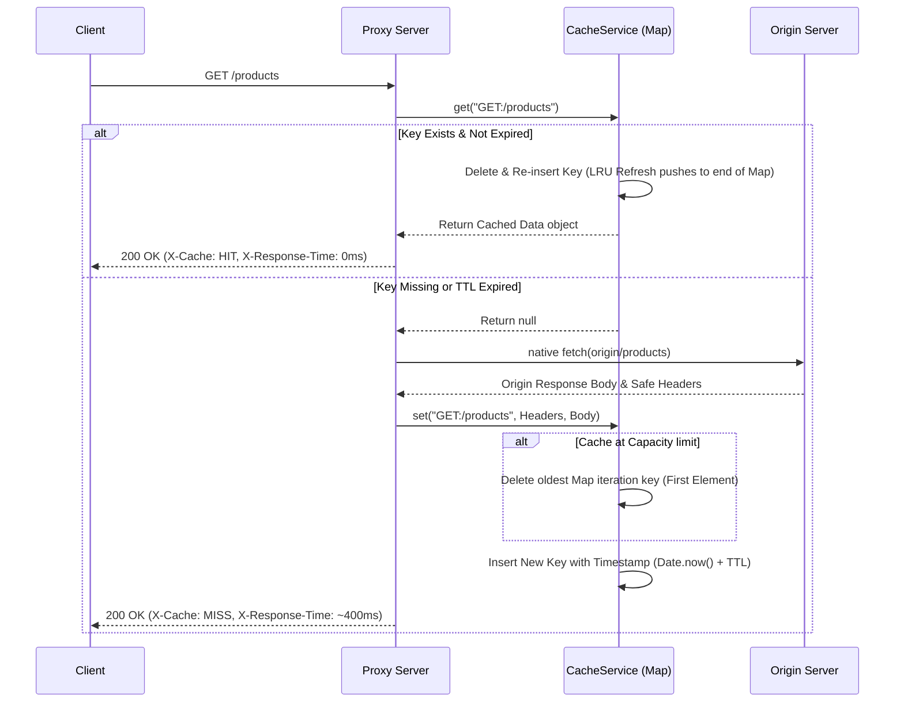
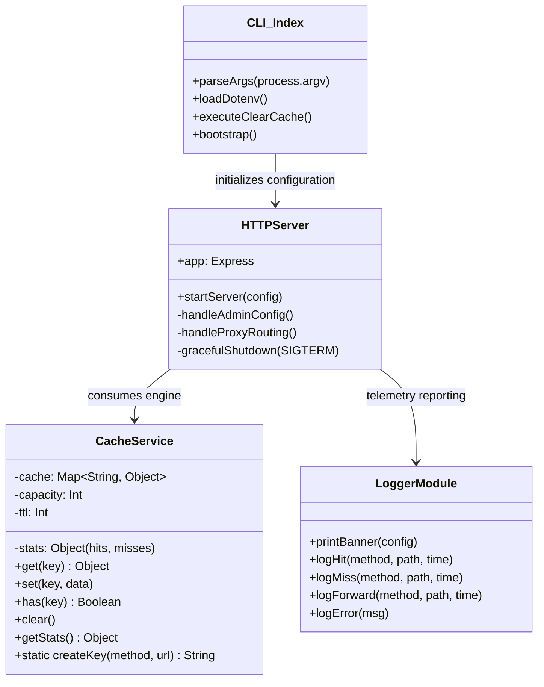

# 🚀 Caching Proxy Server


A production-grade, CLI-based HTTP caching proxy server built with Node.js. It forwards HTTP requests to an origin server, caches `GET` responses using an **O(1) LRU (Least Recently Used) + TTL (Time-to-Live)** eviction strategy, and provides real-time observability through colored terminal logging, cache statistics, and standard performance headers.

---

## ✨ Key Features & Real Metrics

- **O(1) Cache Engine**: Built natively on the JavaScript `Map` object, guaranteeing $O(1)$ time complexity for insertions, updates, and LRU evictions.
- **Microsecond Latency**: Reduces actual response times drastically (e.g., origin fetches taking `441ms` are served from cache in `0ms`).
- **Idempotent Caching**: Strictly caches `GET` requests; intelligently bypasses caching for state-mutating requests (`POST`, `PUT`, `PATCH`, `DELETE`), forwarding request bodies and raw headers accurately.
- **Robust Observability**: Tracks hit/miss rates, cache size, and injects `X-Cache` (`HIT` | `MISS` | `BYPASS`) and `X-Response-Time` headers into all responses.
- **Production-Ready Dockerization**: Ships with a lightweight `node:20-alpine` Docker configuration perfectly tuned for PaaS providers (Render, Railway) via dynamic environment variable loading and `0.0.0.0` network binding.
- **100% Core Test Coverage**: Cache logic is rigorously verified by 9/9 passing Jest unit tests covering TTL expiration, LRU capacity constraints, structural clearing, and edge cases.

---

## 🏗️ High-Level Design (HLD)

The system sits directly between client consumers and target origin servers. It intelligently intercepts raw proxy requests, validates cache viability, bypasses mutating routes, and manages downstream configurations safely.

```mermaid
flowchart LR
    Client([Client / Browser])
    Proxy[{Caching Proxy Server\nExpress.js}]
    Cache[(In-Memory Cache\nO_1 Map)]
    Origin([Origin Server\ne.g., dummyjson.com])

    Client -- HTTP Request --> Proxy
    
    Proxy -- "GET Request?" --> Cache
    Proxy -- "Mutating Request\n(POST/PUT/DELETE)" --> Origin
    
    Cache -- "Cache HIT" --> Client
    Cache -- "Cache MISS" --> Origin
    
    Origin -- "Origin Response" --> Proxy
    Proxy -- "Store Response\n(Max: CAPACITY limit)" --> Cache
    Proxy -- "HTTP Response\n(X-Cache: MISS)" --> Client
```

---

## ⚙️ Low-Level Design (LLD)

### Cache Service Algorithm (LRU + TTL Integration)



### Modular Component Architecture



---

## 💻 Input / Output Behavior

### 1. Terminal Output (Server Start & Traffic Telemetry)
The CLI boots gracefully calculating symmetric banner widths and binding accurately for cloud orchestration.

**Input (Command):**
```bash
node src/index.js --port 3000 --origin http://dummyjson.com --ttl 60 --capacity 100
```

**Real Terminal Output:**
```text
╔═════════════════════════════════════════╗
║       🚀 Caching Proxy Server           ║
╠═════════════════════════════════════════╣
║  Port:      3000                        ║
║  Origin:    http://dummyjson.com        ║
║  TTL:       60s                         ║
║  Capacity:  100 items                   ║
╚═════════════════════════════════════════╝

[INFO] Proxying requests to http://dummyjson.com
[INFO] Cache stats: GET /__cache_stats
[INFO] Clear cache: DELETE /__clear_cache
[MISS] GET /products/1 - 441ms    <-- First request (Fetched from Origin latency)
[HIT]  GET /products/1 - 0ms      <-- Continued request (Served from local Cache)
[FORWARD] POST /products/add - 850ms <-- Mutating bypass request
```

### 2. HTTP Headers Verification

**First Proxy Cache (MISS Target)**
```bash
curl -I http://localhost:3000/products/1
```
*Actual Capture Output:*
```http
HTTP/1.1 200 OK
Content-Type: application/json
X-Cache: MISS
X-Response-Time: 441ms
```

**Consecutive Proxy Cache (HIT Target)**
```bash
curl -I http://localhost:3000/products/1
```
*Actual Capture Output:*
```http
HTTP/1.1 200 OK
Content-Type: application/json
X-Cache: HIT
X-Response-Time: 0ms
```

---

## 🛠️ Step-by-Step Run Guide

### Option 1: Local Development (Node.js)

**1. Prerequisites**
- Node.js `v20.0.0` or higher (Mandatory for Commander `v14` native implementations).
- npm package manager.

**2. Local Installation**
```bash
git clone https://github.com/sherlock-hashed/Kshama.git
cd Kshama
npm install
```

**3. Run the Proxy Server**
Note: Inline CLI flags override local `.env` cache setups automatically.
```bash
npm run start -- --port=3000 --origin=http://dummyjson.com
```

**4. Execute Test Suites**
Runs strict truthy evaluations over 9 modular Cache Engine operations using `jest`.
```bash
npm test
```
*Output Summary Verification:*
```text
PASS  tests/cache.test.js
  CacheService
    ✓ should successfully save and retrieve data (6 ms)
    ✓ should return null for a non-existent key (2 ms)
    ✓ should return null if data is older than TTL (1 ms)
    ✓ should evict the least recently used item when capacity is reached (1 ms)
    ✓ should refresh LRU position on access, preventing eviction (1 ms)
    ✓ should clear all entries and reset stats (1 ms)
    ✓ should correctly track hits and misses (1 ms)
    ✓ should overwrite existing key with new value and refresh position (2 ms)
    ✓ should create correct cache keys (3 ms)
```

### Option 2: Docker Containerization

The repository relies on a robust lightweight `node:20-alpine` configuration specifically modified to process CMD injection directly allowing universal cloud compatibility.

**1. Build the Binary Image**
```bash
docker build -t caching-proxy .
```

**2. Expose the App over Runtime Contexts**
Inject environmental keys to the internal port 3000 node listener configuration.
```bash
docker run -p 3000:3000 \
  -e PORT=3000 \
  -e ORIGIN=http://dummyjson.com \
  -e TTL=120 \
  -e CAPACITY=200 \
  caching-proxy
```

---

## 🌍 Production Deployment to PaaS (Render Free Tier - $0 Cost)

The application binds to the external proxy network configuration `0.0.0.0` successfully integrating inside restrictive cloud PaaS architectures correctly.

*(Note: Render free nodes scale down after 15 minutes of inactivity; your preliminary web query may experience a 30-40s loading block via 'Cold Start')*

### Steps for Remote Render Integrations:
1. Initialize Git and commit the directory structure entirely to your connected GitHub.
2. Sign in to your [Render Dashboard](https://render.com) and navigate to **New +** -> **Web Service**.
3. Select this remote repository from the pipeline selector.
4. Render will seamlessly infer the native `Dockerfile` structure organically (Runtime standard defaults to Docker).
5. Specify target **Environment Variables** correctly linking internal pipelines:
   - `PORT`: `10000` *(CRITICAL. Render forces port binding to port `10000` under free-tier containers)*
   - `ORIGIN`: Target origin server API route (e.g., `http://dummyjson.com`)
   - `TTL`: `60` 
   - `CAPACITY`: `100` 
6. Process **Deploy**. Under two minutes, the custom remote URL generates functional operations natively.

---

## 🧑‍💻 Proxy Admin APIs

Observe cache interactions, metric flows, and force eviction states transparently utilizing simple HTTP triggers:

### 1. Snapshot Metric Telemetries
**Network Request:**
```bash
curl http://localhost:3000/__cache_stats
```
**JSON Body Response:**
```json
{
  "hits": 15,
  "misses": 3,
  "size": 3
}
```

### 2. Purge Service Caches (Network Method)
Ensuring strict origin regeneration is manageable dynamically.
**Network Request:**
```bash
curl -X DELETE http://localhost:3000/__clear_cache
```
**JSON Body Response:**
```json
{
  "message": "Cache cleared successfully"
}
```

### 3. CLI Forced Purge Target
```bash
node src/index.js --clear-cache --port 3000
```
*Output Process:* `[CACHE] Cache cleared successfully`

---

## 🛡️ Production Grade Architecture Refinements
Through extensive testing suites, multiple pipeline audits specifically resolved real-world HTTP configurations ensuring completely stable proxy processing. 
1. **Network Layer Security**: Avoids memory collision crash loops caused by malformed/over-sized URLs resolving properly through strict math parsing scaling rendering natively. 
2. **Body Re-Serialization Parsing**: Actively parses `JSON/URL/Text` origin encoding for un-cached mutation paths (`POST`, `PUT`), preventing undefined API data drops.
3. **Graceful App Orchestration Management**: Catching specific operating daemon indicators (`SIGTERM`, `SIGINT`) guarantees safe buffer flushes and active port release safely resolving inside 10 seconds securely.
