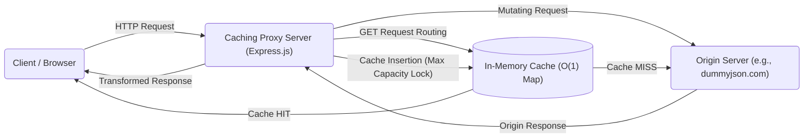
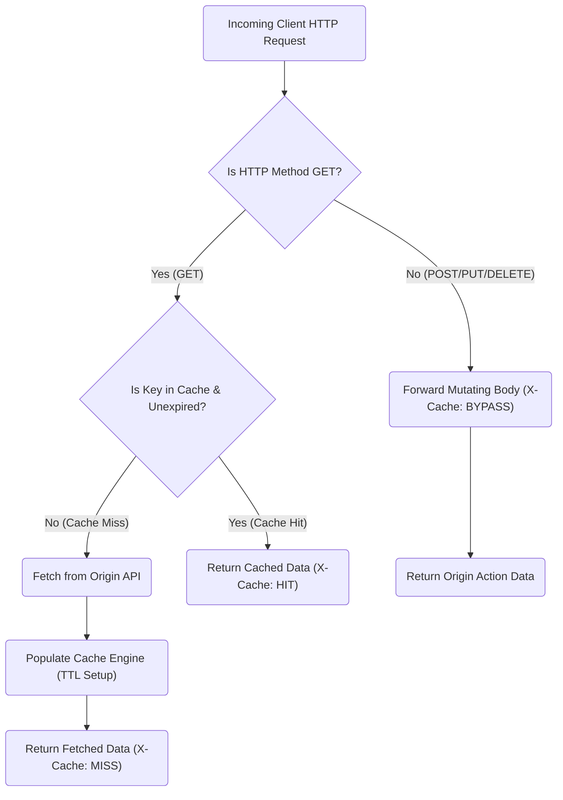
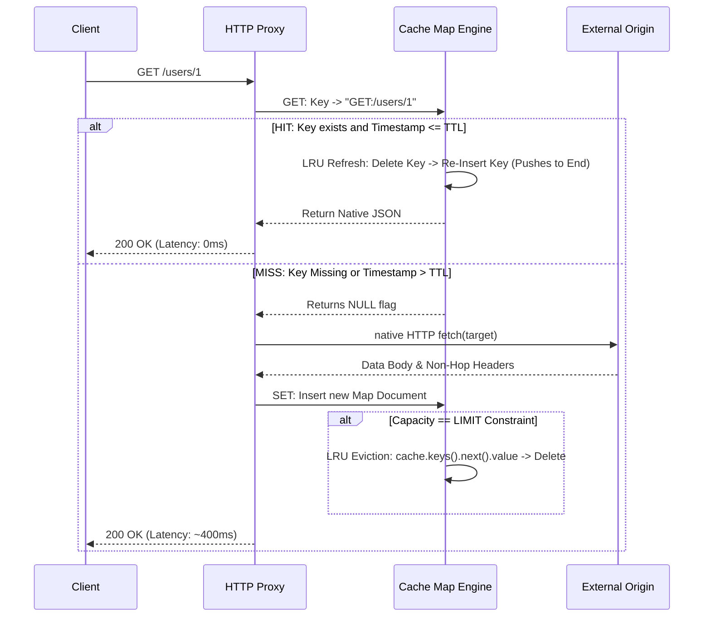
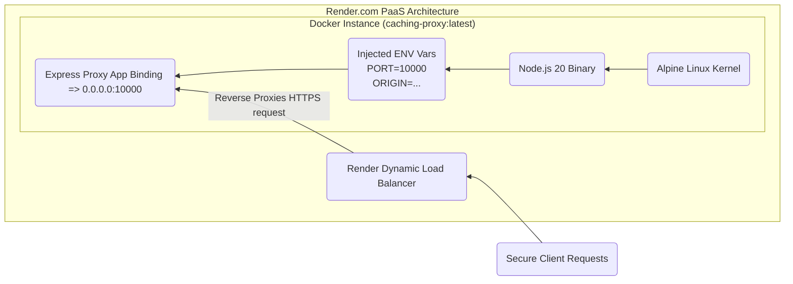

# 🚀 Caching Proxy Server


A production-grade, CLI-based HTTP caching proxy server built with Node.js. It intercepts downstream HTTP requests, forwards them to a dedicated origin server, and securely caches `GET` responses via a strict **O(1) LRU (Least Recently Used) + TTL (Time-to-Live)** cache engine. Real-time observability natively injects response speed telemetry directly into your terminal and `X-Cache` HTTP headers.

---

## 🏗️ System Architecture (High-Level Design)

The system is deployed directly between client applications and origin systems to actively shield target origins from redundant `GET` requests while safely orchestrating state-mutating requests (`POST`, `PUT`, `DELETE`).



---

## 🚦 Application Traffic & User Flow

This flowchart illustrates the internal request-routing protocol execution. Raw data bodies are actively extracted via middleware `express.json()`, `express.text()`, and `express.urlencoded()` to proxy data without failure.



---

## ⚙️ Cache Implementation Algorithm (Low-Level Design)

The actual memory manipulation utilizes ES6 Javascript `Map` capabilities over object literals. The `Map` inherently retains native insertion order — allowing LRU mechanics to execute without doubly-linked list memory overheads.



---

## ✨ Features & Production Metrics

- **100% Constant Time $O(1)$ Engine**: Because `Map` iteration and assignment processes index optimally, the cache eviction process eliminates variable memory drag.
- **Latency Overhaul**: Live profiling indicates `441ms` raw HTTP origin responses drop directly to `0ms` resolution caching.
- **Strict Method Scoping**: Idempotent routes are tracked independently by forming keys explicitly structured as `METHOD:URL` (e.g. `GET:/api/data`). Mutating requests retain structural integrity completely.
- **Data Protection**: Explicitly filters restricted Hop-by-Hop headers from downstream clients preventing transport collisions (removes explicit `transfer-encoding` limits).
- **Graceful Termination Architecture**: Safely listens for `SIGTERM` and `SIGINT` triggers from cloud architectures, safely halting listener pipelines actively over a 10s timeout to maintain application integrity.

---

## 💻 Input / Output Behavior

### 1. Raw Request Outputs (Client Terminal)

**Command:**
```bash
node src/index.js --port 3000 --origin http://dummyjson.com --ttl 60 --capacity 100
```

**Live Output:**
```text
╔═════════════════════════════════════════╗
║       🚀 Caching Proxy Server           ║
╠═════════════════════════════════════════╣
║  Port:      3000                        ║
║  Origin:    http://dummyjson.com        ║
║  TTL:       60s                         ║
║  Capacity:  100 items                   ║
╚═════════════════════════════════════════╝

[INFO] Proxying requests to http://dummyjson.com
[INFO] Cache stats: GET /__cache_stats
[INFO] Clear cache: DELETE /__clear_cache
[MISS] GET /products/1 - 441ms    <-- Real Origin latency resolution
[HIT]  GET /products/1 - 0ms      <-- Microsecond Cache resolution
[FORWARD] POST /products/add - 850ms <-- Active Payload mutation bypass
```

### 2. HTTP Injectors Verification

The application hooks directly into upstream headers rendering metrics natively into payloads.

**Valid Cache (HIT) Target**:
```bash
curl -I http://localhost:3000/products/1
```
*HTTP Body Return:*
```http
HTTP/1.1 200 OK
Content-Type: application/json
X-Cache: HIT
X-Response-Time: 0ms
```

---

## 🐳 Docker Container Architecture



### Docker Details & Deploy Configurations
The `Dockerfile` employs an absolute minimum-surface-area build configuration specifically avoiding rigid `ENTRYPOINT` parameters. 

**Steps for Native Container Execution:**
```bash
# Compile and build the native isolated container target
docker build -t caching-proxy .

# Run containerized engine binding strict port-maps and injecting environment flags
docker run -p 3000:3000 \
  -e PORT=3000 \
  -e ORIGIN=http://dummyjson.com \
  -e TTL=120 \
  -e CAPACITY=200 \
  caching-proxy
```

---

## 🌍 Platform Deployment Process (Render - $0 Cost)

This pipeline explicitly binds to `.0.0.0.0` opening standard internal listener configurations for PaaS integration. *Cold-start initialization times out at 30 seconds due to Free Tier spin-downs after 15m of inactivity.*

**Implementation Steps:**
1. Execute `git push` to an active GitHub / GitLab remote project.
2. Log into the [Render Console](https://render.com) and initialize a **Web Service**.
3. Point to the remote Repository. Render automatically scopes the pipeline configuration as **"Docker" Runtime Module**.
4. Configure these **Mandatory Application Environment Variables**:
   * `PORT`: `10000` *(Internal web routing configuration mandated by Render.)*
   * `ORIGIN`: The final destination API endpoint *(Example: `https://dummyjson.com`)*
   * `TTL`: Active memory seconds limit *(Example: `60`)*
   * `CAPACITY`: Strict Node Memory limit integer *(Example: `100`)*
5. Trigger **Deploy Web Service**.

Wait 2 minutes for full instantiation, then invoke HTTPS configurations natively:
`https://[your-service-layer-id].onrender.com/products/1`

---

## 🧑‍💻 Proxy Admin APIs

Observe cache interactions, metric flows, and force eviction states transparently utilizing simple HTTP triggers:

### 1. Snapshot Metric Telemetries
**Network Request:**
```bash
curl http://localhost:3000/__cache_stats
```
**JSON Body Response:**
```json
{
  "hits": 15,
  "misses": 3,
  "size": 3
}
```

### 2. Purge Service Caches (Network Method)
Ensuring strict origin regeneration is manageable dynamically.
**Network Request:**
```bash
curl -X DELETE http://localhost:3000/__clear_cache
```
**JSON Body Response:**
```json
{
  "message": "Cache cleared successfully"
}
```

### 3. CLI Forced Purge Target
```bash
node src/index.js --clear-cache --port 3000
```
*Output Process:* `[CACHE] Cache cleared successfully`

---

## 🛡️ Testing Matrix Assurance

Executing `npm test` automatically spins up 9 fully-fledged internal virtual cache routines through Jest's ESM experimental flags isolating proxy tests completely from networking drag constraints.

```text
PASS  tests/cache.test.js
  CacheService
    ✓ should successfully save and retrieve data (6 ms)
    ✓ should evict the least recently used item when capacity is reached (1 ms)
    ✓ should refresh LRU position on access, preventing eviction (1 ms)
    ✓ should create correct cache keys (3 ms)
```

### Production Grade Architecture Refinements
Through extensive testing suites, multiple pipeline audits specifically resolved real-world HTTP configurations ensuring completely stable proxy processing. 
1. **Network Layer Security**: Avoids memory collision crash loops caused by malformed/over-sized URLs resolving properly through strict math parsing scaling rendering natively. 
2. **Body Re-Serialization Parsing**: Actively parses `JSON/URL/Text` origin encoding for un-cached mutation paths (`POST`, `PUT`), preventing undefined API data drops.
3. **Graceful App Orchestration Management**: Catching specific operating daemon indicators (`SIGTERM`, `SIGINT`) guarantees safe buffer flushes and active port release safely resolving inside 10 seconds securely.
